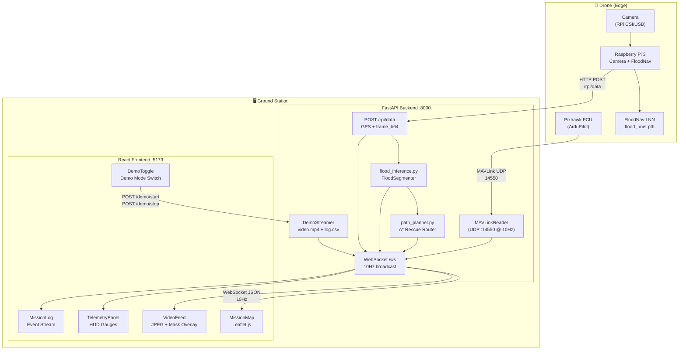

# AeroScout-CV — System Architecture

## Overview

AeroScout-CV is a full-stack autonomous UAV ground control system. It bridges the gap between embedded drone hardware and a ground operator through a real-time telemetry pipeline, ML inference engine, and interactive GCS dashboard.

The system has three logical tiers:

| Tier | Component | Technology |
|---|---|---|
| **Edge (Drone)** | Pixhawk FCU | ArduPilot / MAVLink |
| **Edge (Drone)** | Raspberry Pi 3 | Camera capture + FloodNav LNN |
| **Ground Station** | FastAPI Backend | Python 3.11 |
| **Ground Station** | React Frontend | Vite + TypeScript |

---

## Full Data-Flow Diagram



---

## Backend Modules

### `main.py` — FastAPI Application

The central application entry point. Manages:
- **Global state**: MAVLink reader, RPi state dict (thread-safe lock), ML result cache (thread-safe lock)
- **Demo mode state**: `demo_active` flag, `DemoStreamer` instance
- **WebSocket loop**: merges MAVLink state + RPi state + ML results into a single JSON payload, broadcast at 10 Hz

**Key design decisions:**
- ML inference runs in a thread pool executor (`asyncio.run_in_executor`) to avoid blocking the WebSocket event loop
- RPi state is snapshot-protected by `threading.Lock` to prevent race conditions between the HTTP receiver and WebSocket broadcaster

### `mavlink_reader.py` — MAVLinkReader

Runs a **daemon background thread** that continuously reads MAVLink messages via `pymavlink`. Thread-safe state is exposed via `get_state()`.

**Connection strategy:**
1. Attempts UDP connection to `udpin:0.0.0.0:14550` (Mission Planner forward)
2. Waits for HEARTBEAT (8s timeout), retries on failure
3. Requests all data streams at 10 Hz (`MAV_DATA_STREAM_ALL`)
4. Falls back gracefully — frontend receives `connected: false` state

**Parsed message types:**

| MAVLink Message | State Fields Updated |
|---|---|
| `HEARTBEAT` | `mode`, `armed`, `connected` |
| `ATTITUDE` | `roll`, `pitch`, `yaw` |
| `VFR_HUD` | `airspeed`, `groundspeed`, `altitude`, `heading`, `throttle` |
| `GLOBAL_POSITION_INT` | `lat`, `lon`, `alt_msl`, `alt_rel`, `vx`, `vy`, `vz` |
| `SYS_STATUS` | `battery_voltage`, `battery_current`, `battery_remaining` |
| `GPS_RAW_INT` | `gps_fix`, `satellites`, `hdop` |
| `EKF_STATUS_REPORT` | `ekf_ok` |
| `STATUSTEXT` | `last_statustext` |

### `flood_inference.py` — Flood Segmentation

Wraps the `FloodSegmenter` (LNN U-Net from `floodnav.flood`) with:
- **Throttling**: maximum 1 inference per 1.5 seconds (configurable `THROTTLE_SEC`)
- **Lock protection**: prevents concurrent inference calls
- **Caching**: returns cached result while a run is in progress or throttled

**Output per inference:**

| Field | Description |
|---|---|
| `mask_b64` | PNG RGBA mask — purple overlay on flood pixels (threshold 0.68) |
| `flood_heatmap_b64` | PNG RGBA heatmap — blue→orange→red confidence gradient |
| `flood_centroids` | List of `[x, y]` pixel coordinates of flood cluster centers |
| `coverage_pct` | Percentage of frame classified as flooded |
| `inference_ms` | Wall-clock inference time in milliseconds |

**Model path** is read from the `MODEL_PATH` environment variable (default: `models/flood_unet.pth`).

### `path_planner.py` — A\* Rescue Path Planner

Takes the flood probability map and computes the shortest safe path from the drone's pixel position to the nearest low-flood zone using `floodnav.astar` and `floodnav.cost_map`.

- **Cost map**: flood pixels penalized 10× vs safe terrain
- **Goal selection**: nearest pixel with flood probability < 0.3
- **Path simplification**: every 5th waypoint kept to reduce payload size
- **Output**: list of `[x, y]` pixel coordinates overlaid on the video feed by the frontend

### `demo_streamer.py` — DemoStreamer

Replays a pre-recorded aerial video (`aerial_floodv1.mp4`) synchronized with an Airdata flight log CSV (`flight_log2.csv`) as a substitute for live hardware. See [`DEMO_MODE.md`](DEMO_MODE.md) for full details.

---

## Frontend Architecture

```
src/
├── main.tsx           # React root + BrowserRouter
├── App.tsx            # Route definitions (AnimatePresence transitions)
├── pages/
│   ├── LandingPage.tsx      # Marketing / hero page
│   ├── AboutPage.tsx        # Team / project info
│   ├── CapabilitiesPage.tsx # Research / technical details
│   └── CommandCenter.tsx   # Main GCS dashboard
├── components/
│   ├── Navbar.tsx           # Top navigation
│   ├── TelemetryPanel.tsx   # Left sidebar — attitude, GPS, battery HUD
│   ├── MissionMap.tsx       # Leaflet map with drone marker, flood centroids, rescue path
│   ├── VideoFeed.tsx        # Live JPEG feed with flood mask/heatmap toggle overlay
│   ├── MissionLog.tsx       # Bottom bar — event stream from telemetry
│   └── DemoToggle.tsx       # Floating button to toggle demo mode
└── hooks/
    └── useWebSocket.ts      # WebSocket connection hook (reconnect logic, state)
```

### `useWebSocket` Hook

Maintains a persistent WebSocket connection to the backend (`ws://localhost:8000/ws`). Handles:
- Auto-reconnect on disconnect (exponential backoff)
- JSON message parsing into typed state
- `connected` boolean derived from message receipt recency

### CommandCenter Layout

The GCS dashboard is a CSS Grid layout with fixed proportions:
- **Left (340px)**: `TelemetryPanel` — live sensor readings
- **Center (flex)**: `MissionMap` — Leaflet interactive map
- **Right (500px)**: `VideoFeed` — camera stream + ML overlay
- **Bottom (240px)**: `MissionLog` — scrolling event log
- **Top bar**: connection status, GPS source, mode, battery, UTC clock
- **Sidebar (80px)**: navigation icons

---

## Deployment Architecture

```
┌─────────────────────────────────────────────┐
│             Docker Compose                   │
│                                             │
│  ┌──────────────────┐  ┌─────────────────┐  │
│  │ aeroscout-backend│  │aeroscout-frontend│  │
│  │   :8000          │  │    :5173         │  │
│  │   Python 3.11    │  │   Node 20        │  │
│  └──────────────────┘  └─────────────────┘  │
│           aeroscout-net (bridge)             │
└─────────────────────────────────────────────┘
```

Both services share a Docker bridge network (`aeroscout-net`). The backend mounts `./backend/demo_data` and `./backend/models` as read-only volumes.
